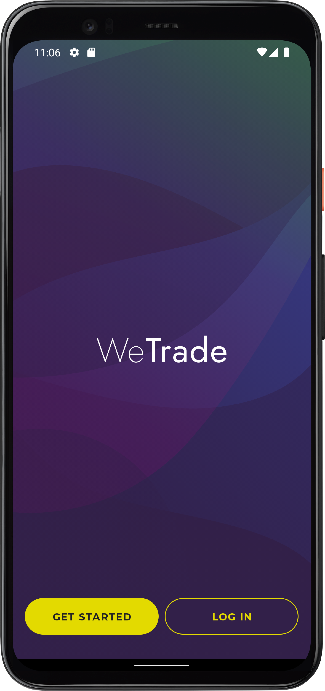
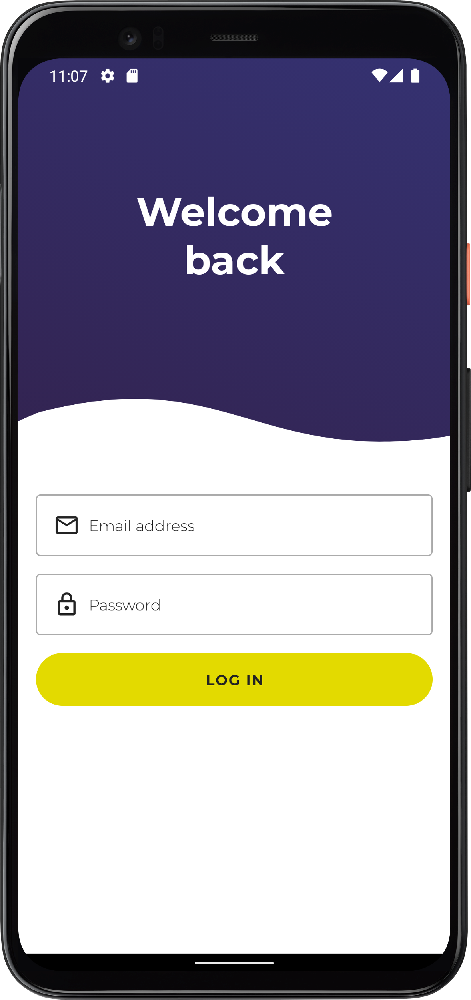
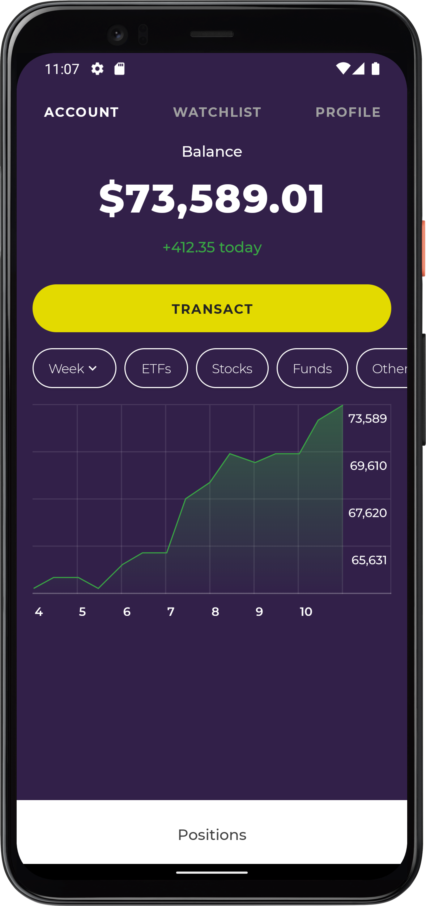
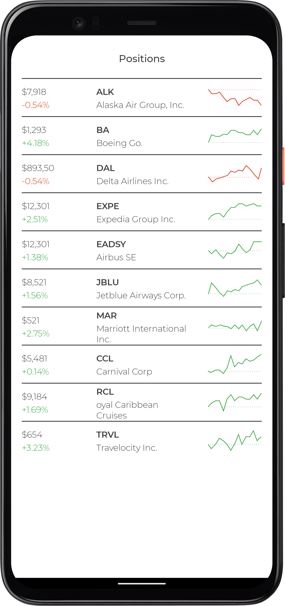

### Intro
根据[App Design](https://github.com/android/android-dev-challenge-compose/blob/assets/WeTrade.zip)使用Compose实现的WeTrade页面。

使用Compose Navigation实现Welcome-Login-Home三个页面的跳转。

### Preview

#### Pages

| Welcome | Login |
| - | - |
|||

| Home | Home List |
| - | - |
|||
